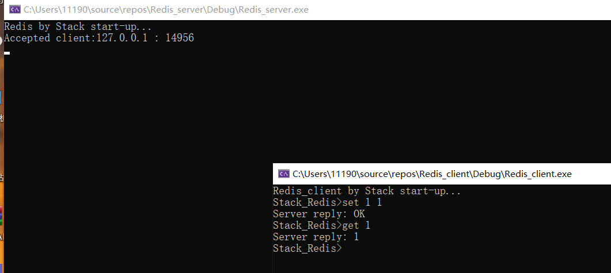

# 基于跳跃表的CS架构数据库

## 初期目标： 

1.使用跳表作为底层的存储数据结构。

2.使用和Redis相同的语法，进行增删改查。

3.使用网络编程技术，将该程序部署到服务器。

4.实现负载均衡技术。

## 概述：

### 1.跳表

提高跳表的查询效率：使用随机的方法确定每个节点将占据的层次数。随机化方法有待调整。

缺陷：对于模板的支持不够好，虽然使用了泛型编程，但是现在只支持string，int，等基本类型。使用其他自定义类型还是需要重新定义compare()函数才行。

### 2.查询语句

使用set 进行存储于修改 使用get 进行查询 使用del 进行删除 使用load 从disk中读取数据 使用dump 将数据存入disk

### 3.服务器部署

在windows下，使用winsock2 ddl库，在客户端和服务器间建立socket连接。需要关注的问题是，当Client或者Server中的一方断开连接后，对端需要及时发现连接断开并销毁连接对象，退出线程。

### 4.负载均衡

....

## 文件：

这里我简述一下各个文件的内容。有几位同学反应代码拉到本地后无法运行，会报宏重复定义的错误，我已经直接将sln工程文件一并推到仓库。

### client文件夹：

1. Client.cpp：main函数在该文件中,Client对象对连接进行管理，运行该程序后 Client会自动连接到服务器的 5150 端口。
2. Command.h：定义了 服务器支持处理的 五种指令：set get del load dump。在客户端向服务器发送请求前，会根据Command中的指令，检查请求是否合理。

### server文件夹：

1. Server.h ：定义了Server类和 Client类 ，Client负责对socket进行管理。Server负责对Client和数据库进行管理。
2. Server.cpp：main函数在该文件中，Server中的socket负责监听可能的客户端连接，新的的连接会被绑定到client的socket上，并新建一个子进程来处理客户端的请求。
3. Command.h： 定义了 服务器支持处理的 五种指令：set get del load dump。并给出了通过客户端发来的一串string 解析出指令的方法。
4. Node.h： 定义了跳表中的节点。
5. Random.h： 包含随机数产生方法。
6. Skiplist.h：实现了了跳表结构，并实现了set get del load dump这五种方法。

## 使用：

将文件下载到本地后，直接用vs点击sln打开项目，再运行即可。

